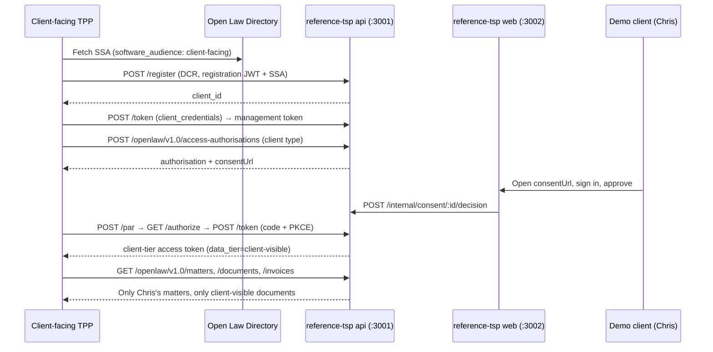

# OpenLaw UK — Reference TSP

A runnable reference Technical Service Provider (TSP) for the Open Law ecosystem. It implements
the trust and data rails defined by the Open Law specifications so that TPPs — especially
**client-facing** apps chosen by law-firm clients from an open marketplace — can be built and
tested against a realistic target.

## What is included

| Package | Description |
| --- | --- |
| `apps/api` | NestJS (Fastify adapter) auth server (DCR, PAR, authorize, token) + resource server with data-boundary enforcement, backed by PostgreSQL via Prisma |
| `apps/web` | Next.js app: demo client login, consent screen, LSP admin approval screen |
| `packages/shared` | Types shared between api and web |

## The journey this proves



## Sandbox

The [sandbox/](sandbox/) folder runs the whole ecosystem locally — `start-local.ps1` boots the
directory, this TSP's api + web, and the Mattertwo stack (Connect, portal, consent-ui) on
ports 3000–3300 and seeds the demo firm; `stop-local.ps1` shuts it all down. It also documents
how to prove the end-to-end journey with `mattertwo-openlaw-connect`'s `pnpm e2e` script and
the `openlawuk-conformance-suite` CLI. (Docker compose files exist but are not the supported
path for now.)

## Running locally

Requires a reachable PostgreSQL server. Copy `apps/api/.env.example` to `apps/api/.env`,
set `DATABASE_URL`, and apply the schema with `pnpm --filter @openlawuk/reference-tsp-api exec prisma migrate deploy`.

```bash
pnpm install
pnpm build

# terminal 1 — the directory (sibling repo) on :3000
cd ../openlawuk-directory && pnpm start

# terminal 2 — the TSP api on :3001
pnpm --filter @openlawuk/reference-tsp-api start

# terminal 3 — the consent web app on :3002
pnpm --filter @openlawuk/reference-tsp-web dev
```

Environment (api): `PORT` (3001), `DATABASE_URL` (PostgreSQL connection string), `ISSUER`, `DIRECTORY_URL` (http://localhost:3000),
`WEB_BASE_URL` (http://localhost:3002), `ALLOW_INSECURE_DEMO_HOOKS` (set to `1` to register the
unauthenticated `/internal/*` demo hooks — required by the consent web app and the conformance
suite's fixture automation; never set in production). Environment (web): `TSP_API_URL`
(http://localhost:3001).

## Seed data

The database seeds itself on first start:

- **Demo & Co** — the law firm (LSP) this TSP hosts
- **Chris Client** (`chris@example.com` / `demo-password`) — demo client with two matters
- **Olivia Other** — another client with one matter (must never appear in Chris's data)
- Documents and notes across `client-visible`, `internal`, and unset tiers to exercise the
  data-boundary rules from `openlawuk-read-write-api/docs/data-boundaries.md`

## Sandbox simplifications

Documented divergences from a production FAPI 2.0 deployment:

- No mTLS (DPoP provides sender-constrained tokens instead)
- The consent web session is a simple demo cookie, not a real identity provider
- `/internal/*` routes are unauthenticated and only registered when `ALLOW_INSECURE_DEMO_HOOKS=1`
  (a real TSP puts these behind its own session auth); the consent web app requires them

## Tests

```bash
pnpm test
```

Covers DCR happy/reject paths (bad SSA signature, expired SSA, redirect-uri superset,
wrong auth method), the full client consent + PKCE journey, firm authorisation approval,
and the data-boundary filters.

## Licence

Apache-2.0
